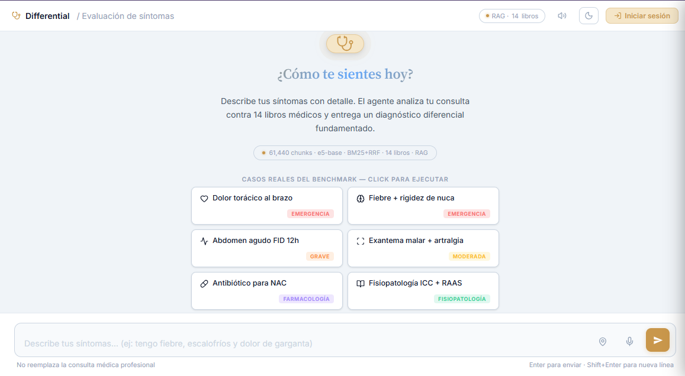

# Differential — Práctica de Diagnóstico Diferencial

[](https://github.com/Dev-Sot/Differential/actions/workflows/ci.yml)


**🔗 Demo en vivo:** en proceso de redeploy a Hugging Face Spaces (gratis, Docker — ver [Deploy](#deploy)).

> El demo gratuito se duerme tras 48 h sin visitas; la primera carga después de eso tarda ~1–2 min mientras el contenedor arranca y descarga los modelos.

Entrena el razonamiento clínico que los libros no te enseñan. Differential no te da un diagnóstico — te presenta un caso, **tú** propones tu diferencial, y el sistema te evalúa y cita la fuente exacta del libro que lo respalda. Construido sobre un pipeline RAG real (BM25 + FAISS + reranker + agente ReAct con Qwen2.5-7B) contra libros médicos reales.


<sub>El chat libre — sin necesidad de cuenta. Los números de esta captura son de una build anterior; el conteo real de libros/chunks se actualiza solo desde `/api/health`.</sub>

### Contenido

[Cómo funciona](#cómo-funciona) · [Arquitectura](#arquitectura) · [Características](#características) · [Métricas](#métricas-de-evaluación) · [Libros indexados](#libros-indexados-8-de-14-activos) · [Stack técnico](#stack-técnico) · [Inicio rápido](#inicio-rápido) · [Variables de entorno](#variables-de-entorno) · [API Endpoints](#api-endpoints) · [Tests](#tests) · [Deploy](#deploy) · [Estructura](#estructura-del-proyecto)

---

## Cómo funciona

La mayoría de los asistentes médicos con IA hacen esto: describes síntomas → la IA te da un diagnóstico → lo lees. Differential invierte el orden a propósito:

```
1. El sistema presenta un caso clínico real
2. TÚ propones tu diferencial y tu razonamiento
3. El sistema evalúa tu respuesta y cita el libro exacto que la respalda
```

Es el mismo motor (RAG + agente ReAct), pero quién razona es distinto — los exámenes de medicina evalúan tu capacidad de razonar un diferencial, no si sabes leer la respuesta de una IA.

**Dos modos de acceso:**
- **Chat libre (`/`)** — sin cuenta, sin fricción. Describe síntomas, recibe un diagnóstico diferencial fundamentado con citas.
- **Práctica de casos (`/practice`)** — requiere cuenta gratuita (para guardar tu progreso). Casos reales, autoevaluación tipo Anki, coaching con IA si hay `HF_TOKEN` configurado.

---

## Arquitectura

```
Consulta del usuario
        │
        ▼
┌───────────────────┐
│    Guardrails     │  ← filtro regex pre-LLM (médico vs no-médico)
└────────┬──────────┘
         │
    ¿HF_TOKEN?
    ┌────┴─────────────────────────────┐
    │ Sí                               │ No
    ▼                                  ▼
┌──────────────────────┐   ┌──────────────────────┐
│   ReAct Agent        │   │    RAG Template       │
│   Qwen2.5-7B (HF)    │   │    (sin LLM)          │
│   max 6 iteraciones  │   └──────────┬───────────┘
│   4 tools            │              │
└──────────┬───────────┘              │
           └──────────┬───────────────┘
                      ▼
        ┌──────────────────────────────────┐
        │   BM25 + FAISS IndexFlatIP        │
        │   Reciprocal Rank Fusion (RRF)    │
        │   + CrossEncoder reranker         │
        │   mMARCO multilingüe (26 idiomas) │
        │   8 de 14 libros médicos activos  │
        └──────────────────────────────────┘
```

---

## Características

| Feature | Descripción |
|---------|-------------|
| **Chat libre, sin cuenta** | Describe síntomas y recibe un diferencial fundamentado — cero fricción para probar el producto |
| **Práctica de casos** | 10 casos clínicos originales (propios, sin copyright), autoevaluación tipo Anki o coaching con IA |
| **Cuentas reales** | Email + password hasheado (`werkzeug.security`) — solo para guardar progreso de práctica |
| **Agente ReAct** | Qwen2.5-7B con 4 tools: `search_symptoms`, `assess_urgency`, `get_drug_info`, `get_section` |
| **Retrieval híbrido** | BM25 + FAISS `IndexFlatIP` fusionados con Reciprocal Rank Fusion (RRF, k=60) |
| **Reranker multilingüe** | cross-encoder mMARCO (26 idiomas) con umbral configurable |
| **Streaming SSE** | Razonamiento token a token en tiempo real |
| **TTS neural** | Text-to-speech con `edge-tts` (`es-ES-AlvaroNeural`) + modo manos libres |
| **Mapa corporal SVG** | 24 zonas interactivas (frontal + dorsal) — inyecta contexto en la query |
| **Perfil clínico** | Modal con alergias, medicamentos y condiciones — inyección silenciosa en cada consulta |
| **Visualización RAG** | Panel colapsable por respuesta: pasos FAISS → reranker → LLM con scores reales |
| **Dashboard métricas** | Gráfico queries/hora, latencia avg/p95, uptime (Chart.js) |
| **Dashboard evaluación** | Recall@1/3/5, MRR, Precision@5 por categoría con 40 queries anotadas |
| **PWA** | Manifest `/manifest.json` — instalable desde el browser |
| **Export PDF** | Por diagnóstico individual o sesión completa |
| **Tema claro / oscuro** | Claro por defecto, toggle persistente en localStorage |
| **Rate limiting compartido** | flask-limiter + Redis — correcto incluso con varios workers de gunicorn |
| **Docker multi-stage** | Build de frontend (Node) separado del runtime (Python) — no se necesita Node en producción |
| **230 tests + E2E** | pytest (backend) + Playwright (navegador real) — ver [Tests](#tests) |

---

## Métricas de evaluación

Dataset v1.3 — 40 queries anotadas (35 médicas + 5 guardrails):

| Métrica | MiniLM · 4 libros | e5-base · 4 libros | e5-base · 14 libros |
|---------|:-----------------:|:------------------:|:--------------------:|
| Recall@1 | 74.3% | 91.4% | 97.1% |
| Recall@3 | 94.3% | 100% | 100% |
| Recall@5 | 97.1% | 100% | 100% |
| MRR | 0.8405 | 0.9571 | 0.9857 |
| Precision@5 | 74.3% | 94.3% | 80.6% |
| Guardrails | 100% | 100% | 100% |

> La configuración **actual en producción** es MiniLM · 8 libros (ver nota abajo) — estos números son de corridas anteriores con e5-base sobre el corpus completo, quedan como referencia de la calidad alcanzable al re-indexar.

---

## Libros indexados (8 de 14 activos)

> El índice se reconstruyó manualmente tras un incidente que borró `index/books.index` local (ver historial de commits). Para tener algo funcional rápido se re-indexó con un modelo de embeddings más liviano y se cortó a propósito en 8 libros completos — los 6 restantes quedan como trabajo pendiente, no perdidos (el texto ya extraído de los 14 libros sigue completo en `index/metadata.json`, re-indexarlos es solo tiempo de cómputo vía `make ingest` o `rebuild_index_from_metadata.py`).

| Libro | Especialidad | Estado |
|-------|-------------|--------|
| Harrison Principios de Medicina Interna 19ª ed. | Diagnóstico diferencial general | ✅ Indexado |
| Adams & Victor's Principles of Neurology 8th ed. | Neurología | ✅ Indexado |
| Harrison's Infectious Disease | Enfermedades infecciosas | ✅ Indexado |
| Infectious Diseases: A Clinical Short Course | Infectología clínica | ✅ Indexado |
| Compendio de Robbins y Cotran Patología | Fisiopatología | ✅ Indexado |
| Kaplan-Sadock Pocket Handbook | Psiquiatría | ✅ Indexado |
| Lange Case Files (Medical) | Casos clínicos integrados | ✅ Indexado |
| ABC of Dermatology | Dermatología | ✅ Indexado |
| Nelson Textbook of Pediatrics | Pediatría | ⏳ Pendiente (libro más grande del corpus, ~1/3 de todos los chunks) |
| Oxford Handbook of Clinical Medicine 10th ed. | Referencia clínica rápida | ⏳ Pendiente |
| Symptoms to Diagnosis | Razonamiento clínico basado en síntomas | ⏳ Pendiente |
| The Top 100 Drugs Clinical | Farmacología y tratamientos | ⏳ Pendiente |
| Tintinalli Emergency Medicine Manual | Urgencias y emergencias | ⏳ Pendiente |
| Williams Obstetrics | Obstetricia y ginecología | ⏳ Pendiente |

---

## Stack técnico

| Capa | Tecnología |
|------|-----------|
| Backend | Flask 3.x + Gunicorn (2 workers sync) |
| Auth | Cuentas reales — `werkzeug.security` (password hasheado), sesión Flask |
| Embeddings | `paraphrase-multilingual-MiniLM-L12-v2` (384 dims) — ver [Libros indexados](#libros-indexados-8-de-14-activos) |
| Índice vectorial | FAISS `IndexFlatIP` (cosine via inner product) |
| BM25 | `rank-bm25` — fusión con FAISS vía Reciprocal Rank Fusion |
| Reranker | `cross-encoder/mmarco-mMiniLMv2-L12-H384-v1` (~120 MB, 26 idiomas) |
| LLM | Qwen2.5-7B-Instruct via HuggingFace Inference API (remoto, opcional) |
| TTS | `edge-tts` — `es-ES-AlvaroNeural` streaming progresivo |
| Persistencia | SQLite — usuarios, sesiones, historial, feedback, intentos de práctica |
| Rate limiting | flask-limiter, respaldado por Redis (memoria solo en dev local) |
| Frontend | TypeScript + Vite + CSS con custom properties (sin framework pesado) |
| PDF | fpdf2 (pure Python, sin dependencias nativas) |
| Tests | pytest (230 aserciones) + Playwright (11 E2E en navegador real) |
| Calidad | ruff + black + mypy (`pyproject.toml`) |
| CI | GitHub Actions — lint + tests (Python 3.13) y build + typecheck (Node 20) |
| Deploy | Docker (build multi-stage) + docker-compose (app + redis) + nginx |

---

## Inicio rápido

### Requisitos previos
- Python 3.13+
- Node.js 20+ (solo para compilar el frontend — no se necesita en runtime)
- Token de HuggingFace (opcional — activa coaching con IA en la práctica de casos y el agente ReAct en el chat)

```bash
# 1. Clonar el repositorio
git clone https://github.com/Dev-Sot/Differential.git
cd Differential

# 2. Crear entorno virtual e instalar dependencias
python -m venv venv
venv\Scripts\activate          # Windows
# source venv/bin/activate     # Linux / Mac
make install

# 3. Compilar el frontend (Vite -> static/dist)
make frontend-install
make frontend-build

# 4. Configurar variables de entorno
copy .env.example .env         # Windows
# cp .env.example .env         # Linux / Mac
# Editar .env: SECRET_KEY es obligatoria fuera de FLASK_DEBUG=True

# 5. Iniciar el servidor
make run
# Abre http://localhost:5000 — el chat funciona sin cuenta
# Crea una cuenta en /signup para practicar casos y guardar tu progreso
```

El índice FAISS (`index/`) **no está en el repo** (contenido derivado de libros con copyright). Sin él la app arranca igual pero el chat responde en modo degradado. Para tenerlo: coloca tus PDFs en `libros/` y corre `make ingest`, o define `INDEX_REPO` para descargarlo de un dataset privado de Hugging Face (ver [Deploy](#deploy)).

### Sin HF_TOKEN
El chat funciona sin token (modo RAG Template — respuestas basadas en los libros, sin razonamiento del LLM). La práctica de casos funciona igual sin token (modo autoevaluación) — el coaching con IA es un plus, no un requisito.

---

## Variables de entorno

| Variable | Default | Descripción |
|----------|---------|-------------|
| `HF_TOKEN` | — | Activa el agente ReAct y el coaching con IA en práctica. Sin él → modo RAG Template / autoevaluación |
| `HF_MODEL` | `Qwen/Qwen2.5-7B-Instruct` | Modelo LLM via HuggingFace Inference API |
| `INDEX_REPO` | — | Dataset de HF Hub (`usuario/nombre`) del que se descargan `books.index` y `metadata.json` al arrancar si no existen localmente. Usa `HF_TOKEN` para datasets privados |
| `SECRET_KEY` | (random) | **Obligatoria en producción** — clave Flask para sesiones. Sin ella la app no arranca fuera de `FLASK_DEBUG=True` |
| `EMBEDDING_MODEL` | `paraphrase-multilingual-MiniLM-L12-v2` | Debe coincidir con el modelo usado para construir `index/books.index` |
| `RERANKER_MODEL` | `cross-encoder/mmarco-mMiniLMv2-L12-H384-v1` | Modelo reranker |
| `RERANK_THRESHOLD` | `-3.0` | Umbral de relevancia (chunks > 0 = relevantes) |
| `CLEANUP_DAYS` | `30` | Días de inactividad para eliminar sesiones |
| `CLEANUP_INTERVAL_HOURS` | `24` | Frecuencia del cron de limpieza automática |
| `MEMORY_DB_PATH` | `data/memory.db` | Ruta del archivo SQLite |
| `PORT` | `5000` | Puerto del servidor |
| `REDIS_URL` | — | Store compartido para el rate limiter. Sin esto, con >1 worker de gunicorn el límite no se aplica correctamente |

---

## API Endpoints

| Endpoint | Método | Auth | Descripción |
|----------|--------|:----:|-------------|
| `/` | GET | No | Chat libre — accesible sin cuenta |
| `/about` | GET | No | Landing / pitch del producto |
| `/login` · `/signup` | GET | No | Páginas de autenticación |
| `/auth/login` · `/auth/signup` · `/auth/logout` | POST | No | Login (5/min) · signup (10/hora) · logout |
| `/practice` | GET | **Sí** | Práctica de casos — requiere cuenta |
| `/api/practice/case` | GET | **Sí** | Siguiente caso clínico (sin la respuesta) |
| `/api/practice/submit` | POST | **Sí** | Enviar diferencial — evalúa y devuelve feedback (30/min) |
| `/api/practice/rate` | POST | **Sí** | Autocalificar un intento (correct/partial/incorrect) |
| `/api/practice/progress` | GET | **Sí** | Resumen de progreso por especialidad |
| `/api/query` | POST | No | Consulta RAG/ReAct — respuesta completa (10/min) |
| `/api/stream` | POST | No | SSE streaming del agente token a token (10/min) |
| `/api/tts` | POST | No | Text-to-speech neural (edge-tts) |
| `/api/export/pdf` | POST | No | Exportar diagnóstico como PDF (5/min) |
| `/api/feedback` | POST | No | Registrar valoración 👍 (1) o 👎 (-1) (30/min) |
| `/api/health` | GET | No | Estado del índice, modelo y modo |
| `/metrics` · `/live` · `/evaluate` | GET | **Sí** | Dashboards internos (métricas, monitor live, evaluación RAG) |
| `/api/reload` | POST | **Sí** | Recargar índice FAISS sin reiniciar servidor |

---

## Tests

```bash
make test                              # Todos los tests (230)
venv\Scripts\pytest.exe tests/ -v      # Con salida detallada

# Por módulo
pytest tests/test_auth.py -v           # Cuentas, login, signup, require_auth
pytest tests/test_practice.py -v       # Banco de casos, evaluacion, progreso
pytest tests/test_guardrails.py -v     # Lógica pura de filtro médico
pytest tests/test_tools.py -v          # Tools del agente (mocks FAISS)
pytest tests/test_memory.py -v         # SQLite — sesiones e historial
pytest tests/test_api.py -v            # Endpoints Flask
pytest tests/test_metrics.py -v        # Métricas en memoria
pytest tests/test_feedback.py -v       # Feedback SQLite + endpoint
pytest tests/test_evaluation.py -v     # Pipeline de evaluación RAG
pytest tests/test_pipeline.py -v       # Pipeline completo end-to-end

# End-to-end (navegador real, Playwright)
make e2e-install                       # Una vez: instala Playwright + Chromium
make e2e                               # 11 tests: auth, chat, sidebar, tema, practica
```

Los tests de `test_retriever.py` hacen skip automático si el índice FAISS no existe — comportamiento intencional para CI.

---

## Deploy

### Hugging Face Spaces (demo público, gratis)

El demo corre en un [Space de Docker](https://huggingface.co/docs/hub/spaces-sdks-docker) en el plan gratuito (2 vCPU, 16 GB RAM) — suficiente para FAISS + embeddings + reranker en CPU. Se usa el mismo `Dockerfile`, sin cambios.

1. **Índice privado** — crea un dataset **privado** en HF (ej. `usuario/differential-index`) y sube `index/books.index` e `index/metadata.json`:
   ```bash
   hf upload usuario/differential-index index/ . --repo-type dataset --private
   ```
2. **Space** — crea un Space nuevo con SDK *Docker* y en *Settings → Variables and secrets* define:
   - `SECRET_KEY` (secret) — `python -c "import secrets; print(secrets.token_hex(32))"`
   - `HF_TOKEN` (secret) — token con lectura del dataset (también activa el agente ReAct)
   - `INDEX_REPO` (variable) — `usuario/differential-index`
3. **Código** — el README del Space necesita un encabezado YAML propio, así que se sube con el script:
   ```bash
   bash scripts/deploy_hf_space.sh usuario/differential
   ```

Al arrancar, `src/rag/retriever.py` descarga el índice del dataset privado; el contenido con copyright nunca queda en el repo público.

### Docker (self-host — Render, Fly.io, un VPS, etc.)

```bash
make docker-build   # incluye un stage de Node que compila el frontend
copy .env.example .env
make docker-run      # levanta app + redis
make docker-ingest   # si el indice no existe, construirlo dentro del contenedor
docker compose logs -f
make docker-stop
```

`docker-compose.yml` levanta un servicio `redis` junto con la app y define `REDIS_URL` automáticamente. Para producción con nginx, usar `nginx/medi-ia.conf` (incluye `proxy_buffering off` para `/api/stream`).

### ⚠️ Por qué no Vercel

El backend carga modelos de embeddings + FAISS + PyTorch en memoria y mantiene estado entre requests — esto no entra en el modelo serverless de Vercel (límite ~250 MB por función, sin disco persistente, timeouts cortos). Hace falta un host que corra el `Dockerfile` como contenedor de larga duración. Los planes gratuitos de Render/Koyeb (512 MB RAM) tampoco alcanzan para los modelos; HF Spaces sí.

---

## Estructura del proyecto

```
Differential/
├── app.py                     # Flask app: rutas HTTP + auth + orquestacion (delgado)
├── ingest.py                  # Indexación de PDFs → FAISS (chunk 600/120, sentence-aware)
├── rebuild_index_from_metadata.py  # Reconstruye books.index desde metadata.json sin PDFs
├── manage.py                  # CLI: listar sesiones, cleanup, clear
├── gunicorn.conf.py           # Config producción (2 workers sync, preload_app)
├── pyproject.toml             # Config de ruff / black / mypy
├── requirements.txt           # Dependencias directas, version fijada
├── requirements-lock.txt      # pip freeze completo — build reproducible
├── requirements-dev.txt       # ruff / black / mypy
├── src/
│   ├── agent.py               # Orquestador: ReAct vs RAG fallback
│   ├── agent_loop.py          # Bucle ReAct + generador SSE (max 6 iteraciones)
│   ├── auth.py                # Cuentas: create_user/verify_user, password hasheado
│   ├── practice.py            # Banco de casos + evaluate_answer + progreso
│   ├── guardrails.py          # Filtro regex pre-LLM
│   ├── llm.py                 # Cliente HuggingFace InferenceClient
│   ├── memory.py              # Historial + feedback en SQLite
│   ├── metrics.py             # Metricas en memoria (queries/hora, latencia, errores)
│   ├── pdf_export.py          # Generacion de PDF (diagnostico + historial de sesion)
│   ├── schemas.py             # Pydantic: ConsultaRequest, DiagnosticoResponse
│   ├── tools.py                # 4 herramientas del agente ReAct
│   ├── evaluation_full.py     # Evaluación completa con dataset anotado
│   └── rag/                   # embeddings, retriever, bm25, reranker, section_mapping
├── frontend/                  # Build del chat UI (Vite + TypeScript)
│   ├── src/main.ts            # Toda la logica de UI, tipada, un solo modulo
│   ├── src/styles/*.css       # CSS organizado por seccion (10 archivos)
│   └── vite.config.ts         # Build -> ../static/dist (lo sirve Flask)
├── e2e/                       # Tests Playwright contra un servidor Flask real
├── templates/
│   ├── index.html             # Chat libre (sin cuenta requerida)
│   ├── landing.html           # Pitch publico, montado en /about
│   ├── login.html · signup.html  # Autenticacion
│   ├── practice.html          # Practica de casos (requiere cuenta)
│   ├── metrics.html · evaluate.html · live.html  # Dashboards internos
├── static/dist/                # Bundle generado por Vite (gitignored, `make frontend-build`)
├── docs/screenshots/            # Capturas para este README
├── data/
│   ├── case_bank.json          # 10 casos clinicos originales (contenido fuente, versionado)
│   ├── memory.db               # SQLite — usuarios, sesiones, feedback (runtime, gitignored)
│   └── eval_dataset.json      # 40 queries anotadas para evaluación (v1.3)
├── tests/                     # 230 tests pytest
├── index/                     # Índice FAISS (no incluido en repo, ver "Libros indexados")
├── libros/                    # PDFs fuente (no incluidos en el repo)
├── nginx/medi-ia.conf         # Config nginx para producción
├── Dockerfile                  # Multi-stage: build frontend (Node) -> runtime (Python)
├── docker-compose.yml          # Servicios: app + redis
└── .github/workflows/ci.yml    # CI: lint + tests (Python) y build + typecheck (frontend)
```

---

## Gestión de sesiones

```bash
make sessions               # Listar sesiones activas
make cleanup                # Limpiar sesiones inactivas > 30 días
make cleanup DAYS=7          # Limpiar sesiones inactivas > N días
venv\Scripts\python.exe manage.py clear <session_id>
```

---

## Nota académica

Differential es una herramienta de práctica y estudio para razonamiento clínico. **No reemplaza la consulta médica profesional ni debe usarse para diagnosticar pacientes reales.** En caso de emergencia, llame al **123** (Colombia) o diríjase a urgencias inmediatamente.
